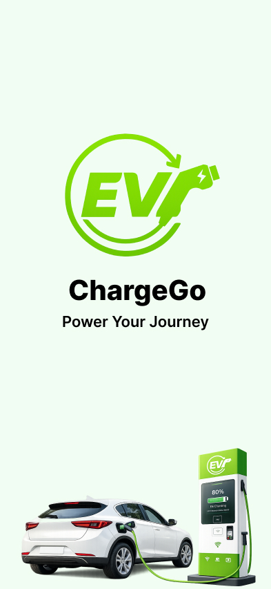
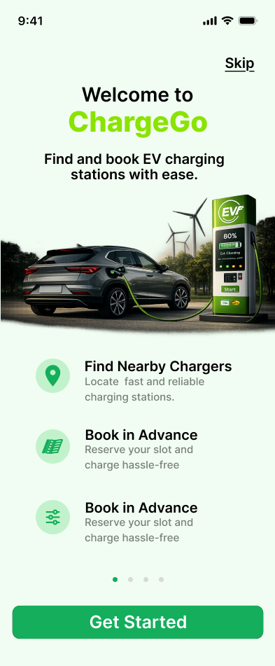

# ⚡ ChargeGo – EV Charging Station Finder App
📌 About the Project

ChargeGo is a modern EV Charging Station Finder Mobile App UI/UX Design created to help users easily find nearby EV charging stations, book charging slots, make secure payments, and manage bookings efficiently.

The app focuses on providing a clean, user-friendly, and eco-friendly experience for electric vehicle users.

# 🚀 Key Features
- Find Nearby EV Charging Stations
- Real-time Station Availability
- Interactive Map Navigation
- Book Charging Slots in Advance
- Secure Online Payments
- Booking History Management
- Multiple Payment Methods
- Modern Green-Themed UI
- Simple & User-Friendly Experience

--------------------------------------------------------------------------------------------------------------------------------------------------------------

# 📱 Screens Included

🔹 Splash Screen

 

- The Splash Screen is the first screen users see when opening the app.
It displays the ChargeGo logo, tagline “Power Your Journey”, and EV charging illustration to create a strong first impression.
The clean green theme represents eco-friendly electric mobility and modern technology.

🔹 Onboarding Screen

 

The Onboarding Screen introduces the app’s main features:
- Find nearby charging stations
- Book charging slots in advance
- Easy and secure charging experience

It helps new users understand the app quickly before getting started.

🔹 Login 

The Login Screen allows existing users to securely access their account using:
- Email and password
- Google login
- Apple login
- Facebook login
It also includes a Forgot Password option for account recovery.

🔹 Sign Up

The Sign Up Screen helps new users create an account by entering:
- Full Name
- Email Address
- Password
- Confirm Password
Users must accept the Terms & Conditions before registration.

🔹 Home Screen

The Home Screen is the main dashboard of the app.
Features include:
- Search nearby charging stations
- Interactive map view
- Station availability status
- Distance and charging type
- Bottom navigation menu
This screen helps users quickly discover nearby EV charging stations.

🔹 Maps Screen

The Maps Screen displays:
- Real-time station locations
- User current location
- Nearby charging stations
- Navigation support
- Search and filter options
Users can easily locate the nearest available charging station.

🔹 Booking Screen

This screen allows users to:
- Select charging date
- Choose available time slots
- View charging type
- Check estimated charging time
- View station facilities such as WiFi, Café, Parking, and Restroom
It simplifies the charging reservation process.

🔹 Payment Screen

The Payment Screen supports multiple payment methods:

- UPI
- Credit/Debit Card
- Net Banking
- Wallets

It also highlights:

- Secure payment protection
- PCI DSS compliance
- Promo code support

This ensures safe and smooth payment transactions.

🔹 Payment Success Screen

After successful payment, users see:
- Booking confirmation message
- Station details
- Charging type
- Date & time
- Payment amount

Users can navigate to:
- My Bookings
- Home Screen

🔹 My Bookings

The My Booking Screen helps users manage all reservations with different tabs:
- History
- Completed
- Upcoming
- Cancelled
Users can track booking status, charging type, schedule, and payment amount.

🔹 Settings Screen

The Settings Screen provides account management options:
- Edit Profile
- Change Password
- Notification Settings
- Dark Mode
- Language Selection
- Privacy Policy
- Terms & Conditions
- Logout

It improves personalization and user control.

#🛠️ Tools Used

- Figma
- Prototype Design
- UI/UX Design Principles

#👨‍💻 Designer
- AAKASH R
- UI/UX Designer
- Passionate about creating modern and user-friendly mobile experiences.
